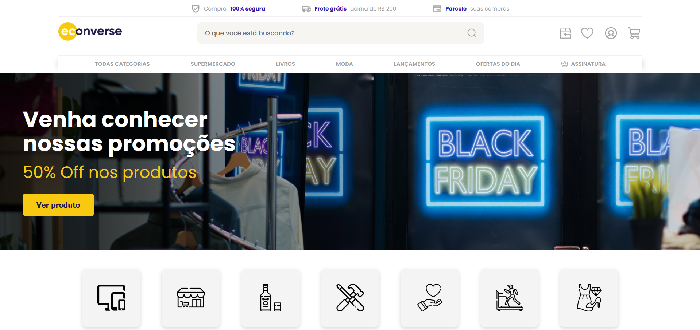
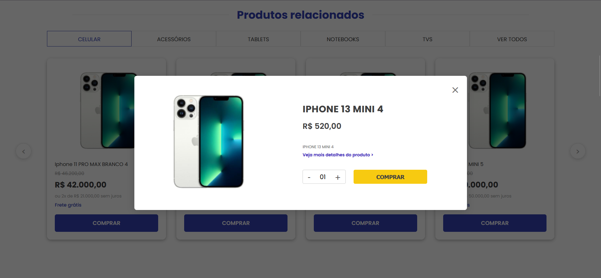
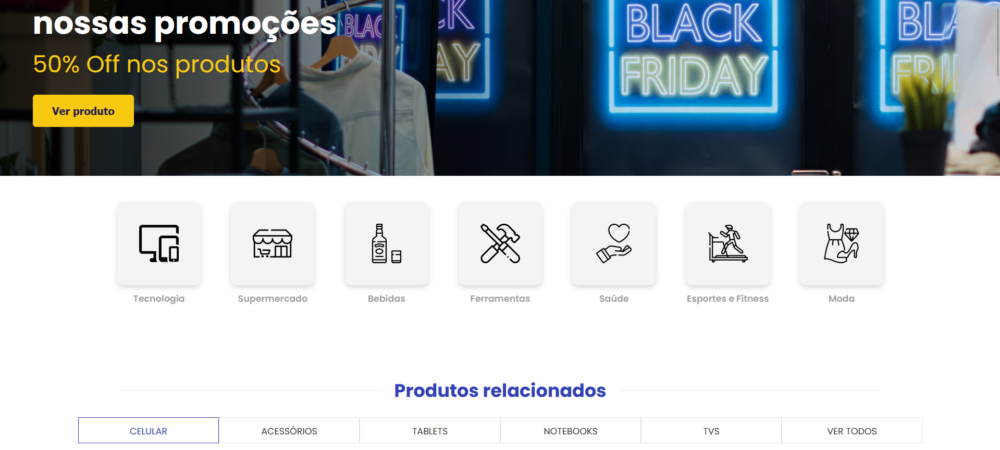
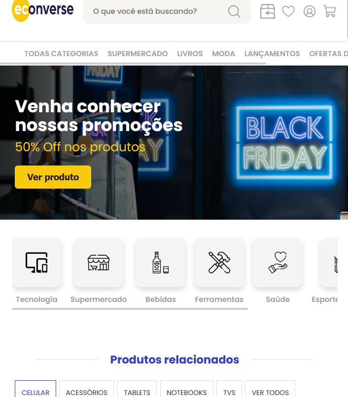

# 🛒 Teste Front-End Econverse

> Projeto desenvolvido para o desafio técnico de Desenvolvedor Front-End.


---

## Tecnologias e Ferramentas
O projeto foi construído utilizando as melhores práticas do ecossistema React atual:

- **React + Vite**: Performance e rapidez no desenvolvimento.
- **TypeScript**: Tipagem estática para maior segurança e escalabilidade.
- **SASS (SCSS)**: Pré-processador para estilização modular e uso de variáveis.
- **Swiper.js**: Implementação de carrossel robusto e performático.
- **Conventional Commits**: Histórico de Git organizado e padronizado.

---

## Imagens

| Desktop | Detalhes do Produto (Modal) |
|---|---|
|  |  |

| Categorias | Responsivo (Mobile) |
|---|---|
|  |  |

---

## Funcionalidades principais

1.  **Integração com API**: Consumo de dados via Fetch API com tratamento de estados (loading/error).
2.  **Custom Hook (`useProducts`)**: Lógica de negócio separada da interface, facilitando a manutenção.
3.  **Modal Dinâmico**: Ao clicar em um produto, um modal é renderizado com as informações específicas do JSON.
4.  **Carrossel Customizado**: Vitrine de produtos com navegação funcional.
5.  **Pixel Perfect**: Atenção rigorosa às medidas, fontes e cores do Figma.
6.  **Responsividade**: Layout adaptável para dispositivos móveis e tablets.
7.  **SEO e Acessibilidade**: Meta tags otimizadas e HTML semântico.

---

## SEO e HTML Semântico

O projeto segue as melhores práticas de otimização para mecanismos de busca e acessibilidade:

### Meta Tags
- `<meta name="description">` e `<meta name="keywords">` para SEO
- Open Graph (`og:title`, `og:description`, `og:image`) para compartilhamento em redes sociais
- Twitter Cards para previews no Twitter/X
- `lang="pt-BR"` para indicar idioma correto

### HTML Semântico
- `<header>` para cabeçalho do site
- `<main>` envolvendo o conteúdo principal
- `<nav>` para navegação com `role="menubar"`
- `<section>` para áreas temáticas
- `<footer>` para rodapé
- `<article>` para conteúdo independente

### Acessibilidade (A11y)
- Atributos `aria-label` em botões e navegação
- `aria-hidden="true"` em ícones decorativos
- Textos alternativos (`alt`) em todas as imagens
- Botões com `type="button"` explícito

---

## Como executar o projeto

1. **Clone este repositório**
   ```bash
   git clone https://github.com/Fortuna09/teste-front-end